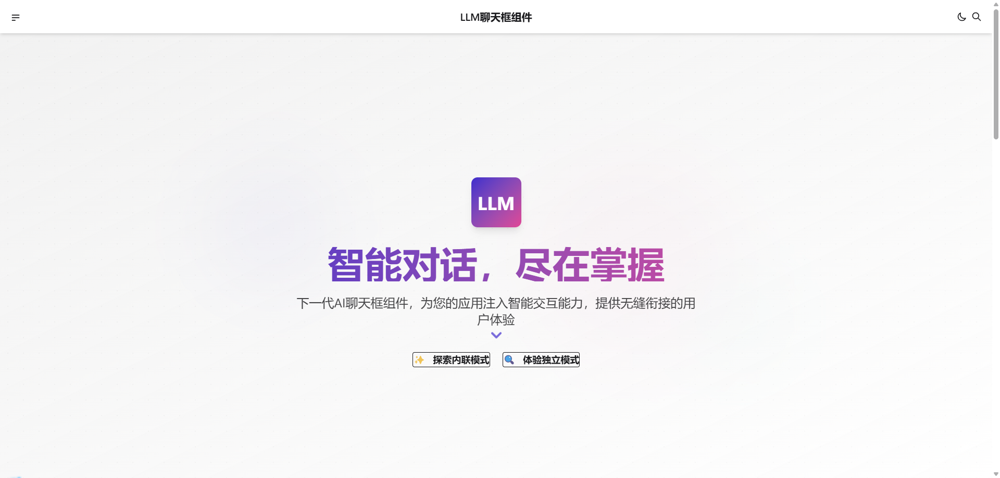

# LLM 聊天框组件 🚀

[](https://github.com/harmon729/llm-chatbox-coze/actions/workflows/ci-cd.yml)
[](https://codecov.io/gh/user/llm-chatbox)
[](https://opensource.org/licenses/MIT)
[](https://makeapullrequest.com)
[](https://www.typescriptlang.org/)
[](https://reactjs.org/)

**革命性的 AI 聊天界面体验！** 这是一个基于 Next.js 构建的现代化 LLM 聊天框组件，为你的应用注入智能交互能力！完美支持多种主题和无限可能的自定义配置，让你的用户沉浸在顶尖的 AI 聊天体验中。

<p align="center">
  
</p>

## ✨ 超凡功能

- 🔥 **响应式设计**：从手机到桌面，完美适配各种设备
- 🌓 **智能主题**：明暗主题自动切换，给用户最舒适的视觉体验
- 📝 **Markdown 渲染**：支持富文本显示，代码高亮，让对话更生动
- 🎨 **高度可定制**：自由调整界面样式，打造专属品牌体验
- 🚀 **一流性能**：优化的渲染和状态管理，保证丝滑的用户体验
- 🔄 **完整 CI/CD**：自动化测试、部署和发布，开发流程无忧

## 🛠️ 强大技术栈

- **前沿框架**: [Next.js 15](https://nextjs.org/) - React 应用开发的终极解决方案
- **炫酷 UI**: [React 19](https://react.dev/) + [TailwindCSS](https://tailwindcss.com/) + [DaisyUI](https://daisyui.com/) - 现代、灵活、美观
- **严格测试**: [Jest](https://jestjs.io/) + [React Testing Library](https://testing-library.com/docs/react-testing-library/intro/) - 保证代码质量
- **闪电部署**: [Vercel](https://vercel.com/) - 全球 CDN，一键发布
- **自动化工作流**: [GitHub Actions](https://github.com/features/actions) - CI/CD 流程的完美实现

## 🚀 开发指南

### 安装依赖

```bash
npm install
```

### 开发服务器

```bash
npm run dev
# 🔥 热更新开发服务将在 http://localhost:3000 启动
```

### 构建项目

```bash
npm run build
# 🏗️ 优化的生产构建将创建在 .next 目录
```

### 运行测试

```bash
npm test
# ✅ 执行所有测试用例

npm run test:coverage
# 📊 生成详细的测试覆盖率报告
```

## 🔄 CI/CD 流程

项目使用 GitHub Actions 实现全自动化的 CI/CD 工作流:

1. **严格代码规范** ✓ 使用 Commitlint 确保提交消息符合规范
2. **全面自动测试** ✓ 代码提交后自动运行 ESLint、TypeScript 检查和测试套件
3. **实时预览环境** ✓ Pull Request 自动部署到 Vercel 预览环境
4. **一键生产部署** ✓ 合并到 main 分支后自动部署到生产环境
5. **智能版本发布** ✓ 使用 Semantic Release 实现自动化版本和发布管理

### 💬 提交规范

项目遵循 Angular 的提交规范，确保清晰的变更记录：

- `feat`: ✨ 新功能
- `fix`: 🐛 修复 Bug
- `docs`: 📚 文档更新
- `style`: 💅 代码风格调整
- `refactor`: 🔄 代码重构
- `perf`: ⚡ 性能优化
- `test`: 🧪 测试相关
- `chore`: 🔧 构建过程或辅助工具变动

提交示例：

```
feat(chat): 添加用户输入验证功能
```

## 🚀 部署指南

项目配置为使用 Vercel 自动部署。若需手动部署，请确保：

1. 设置以下环境变量:

   - `NEXT_PUBLIC_API_URL`: API 地址
   - `NEXT_PUBLIC_APP_ENV`: 环境标识 (`development`/`production`)

2. 执行部署命令:

```bash
vercel
# 🌐 几秒钟内，你的应用将在全球可访问
```

## 📦 版本发布

项目使用 Semantic Release 进行智能版本管理：

1. 合并到 main 分支的代码会自动触发版本更新
2. 版本号基于提交信息自动确定
3. 系统自动生成详细的更新日志和 GitHub Release

## 🤝 贡献指南

我们热烈欢迎所有形式的贡献！无论是新功能、bug 修复还是文档改进，您的参与将使这个项目更加出色。

1. Fork 这个仓库
2. 创建您的特性分支: `git checkout -b feature/amazing-feature`
3. 提交您的更改: `git commit -m 'feat: 添加了一些很棒的功能'`
4. 推送到分支: `git push origin feature/amazing-feature`
5. 提交 Pull Request

## 📜 许可证

本项目采用 [MIT 许可证](LICENSE) - 查看 LICENSE 文件了解详情。

---

<p align="center">
  用 ❤️ 打造 | <a href="https://github.com/user/llm-chatbox">GitHub</a>
</p>
